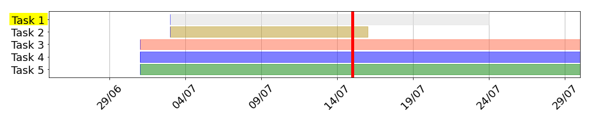

# pyganttplot
Low frills gantt bar-chart plotting fully neglected in Python code. So you need to know Python to use it.

# TLTR;
If you are looking for something feature complete, team sharing functionality, easy configuration, then you should move on.

This is just a bunch of Python code even not obeying any PEP rules.

# What it could be
It is really just a junk of python code that prints an image of a bar chart mimicing a gantt plot.

I am using it for creating some quick and simple plots that I can insert everywhere as an image.

Sometimes I come back and make changes if I need it to suit some specific requirements.

Consequently, as the code is still fairly short it might help you to do the same to create something similar with your specific requests.

